<div align="center">

# Mellow

> *Small moments. Steady momentum.*

**An Android wellness app that makes self-care approachable by keeping it small.**

Sub-minute breathing check-ins · mood tracking with on-device insights · guided journaling · home-screen widgets

</div>

---

## What it is

Instead of long meditation sessions or complex habit trackers, Mellow focuses on **micro check-ins** — guided breathing that takes under a minute — paired with a coin-based reward system, mood journaling, and an optional buddy system.

The philosophy: **consistency matters more than intensity.** A 30-second breathing exercise done daily builds more resilience than an hour-long session done once a month. Mellow reinforces that with streaks, a forgiving grace period, and a coin jar that fills over time.

---

## Design system

The full design system — palette, typography, iconography, mascot, and every screen — is documented as an interactive page:

### 👉 **[`design/index.html`](design/index.html)** — open in a browser

| Page | What's inside |
|------|---------------|
| [`design/index.html`](design/index.html) | **Design system + every screen** (start here) |
| [`design/mellow_screens.html`](design/mellow_screens.html) | Full-app screen concepts, light &amp; dark |
| [`design/mellow_innovative.html`](design/mellow_innovative.html) | Circle, duo bonds, rewards hub, reflections |
| [`design/mellow_journal_buddies.html`](design/mellow_journal_buddies.html) | Journal &amp; buddies concepts with Sprout |
| [`design/mellow_redesign.html`](design/mellow_redesign.html) | The original redesign direction |

### The mood scale

Every mood in the app — calendar cells, journal entries, charts, widgets — resolves to one of five colours.

| | Depressed | Sad | Neutral | Happy | Overjoyed |
|---|---|---|---|---|---|
| **Hex** | `#A694F5` | `#ED7E1C` | `#AEA194` | `#FFCE5C` | `#9BB068` |

### Typography

**Fraunces** (serif display) + **Plus Jakarta Sans** (UI), both bundled as static weights in `res/font` so exact weights render on every API level — no faux-bold, no platform fallback.

### Sprout

The mascot — a calm meditating seedling, built as an Android `VectorDrawable` (no external art, no Lottie). Appears in the breathing orb, the journal prompt, and empty states.

---

## Screens

### Onboarding
<p align="center">
  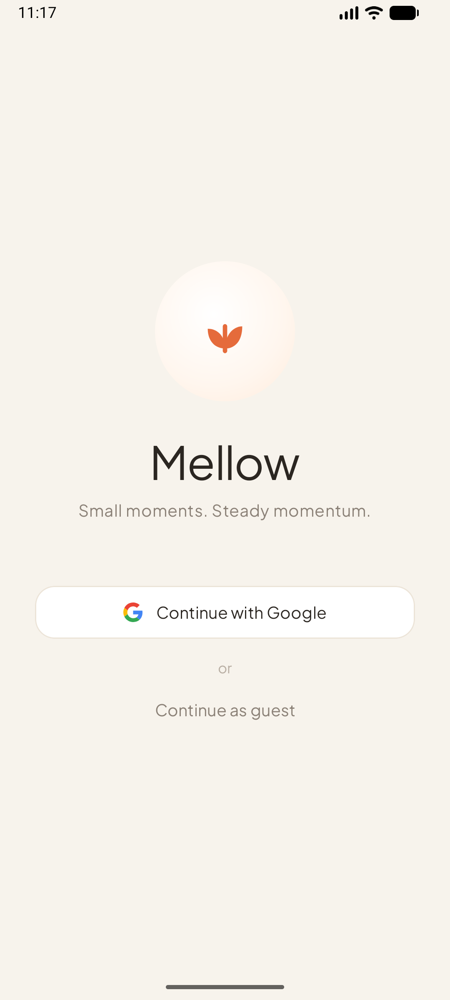
  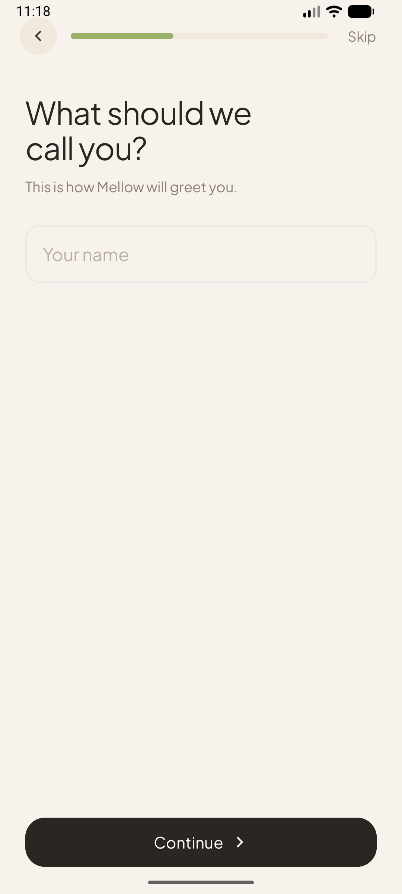
  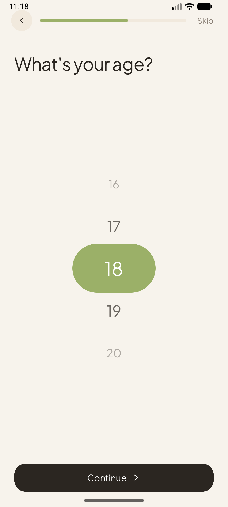
  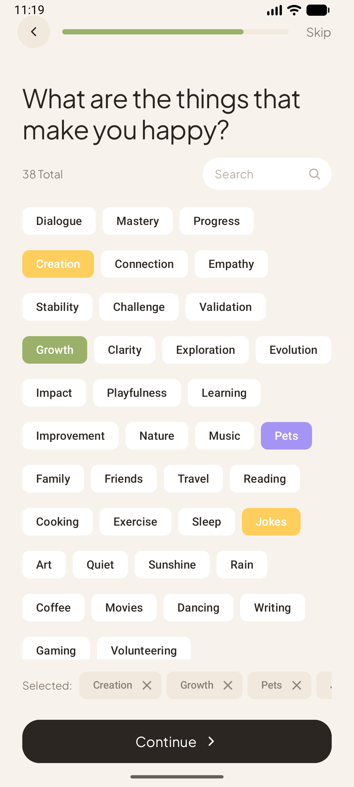
</p>

Five steps — welcome, name, age (a snapping wheel picker), the things that make you happy (a searchable tag cloud), and goals — with a shared progress bar, back and skip.

### The daily loop
<p align="center">
  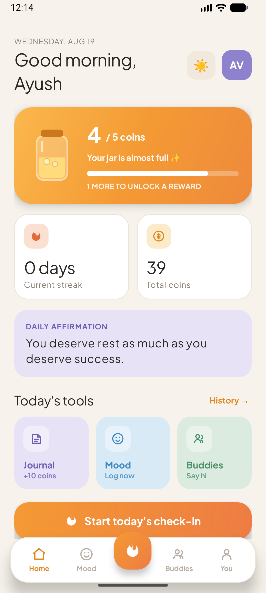
  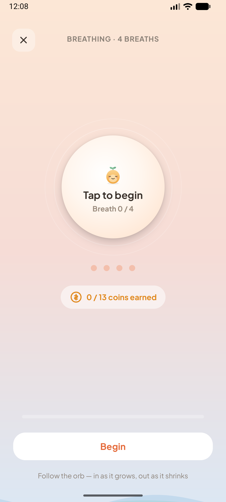
  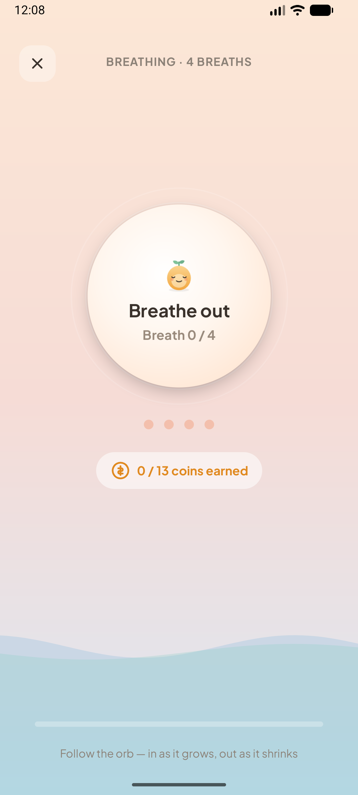
  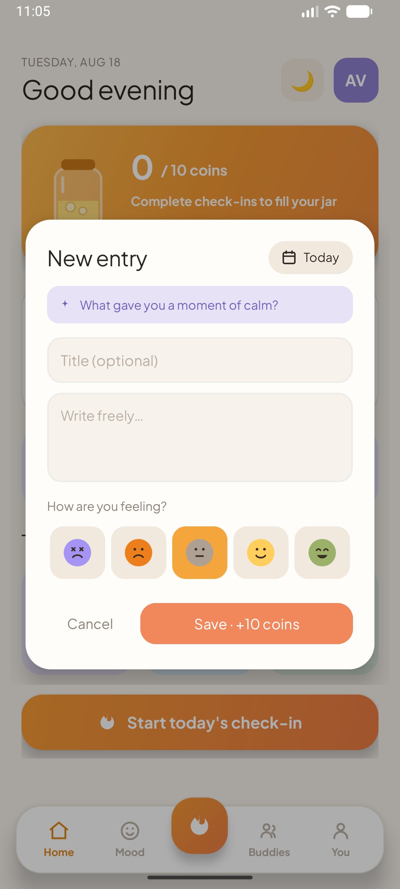
</p>

Home leads with the coin jar, streak and today's tools. The check-in runs four breaths automatically — the screen fills with a soft fluid wave as you breathe, with Sprout in the orb.

### Mood
<p align="center">
  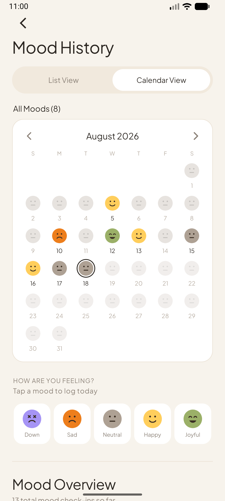
  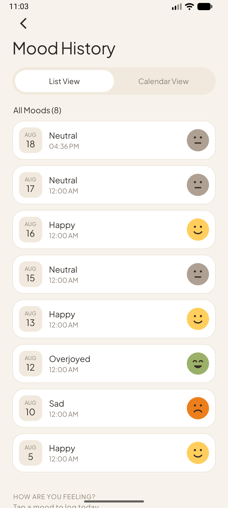
  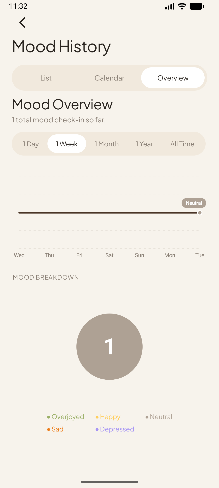
  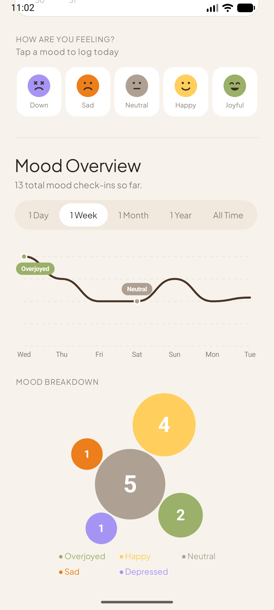
</p>

Three tabs — **List**, **Calendar** (a face per day, backdate any past day) and **Overview** (a smooth spline across 1 Day → All Time, plus a packed bubble chart sized by how often each mood was logged).

### Profile, buddies &amp; widgets
<p align="center">
  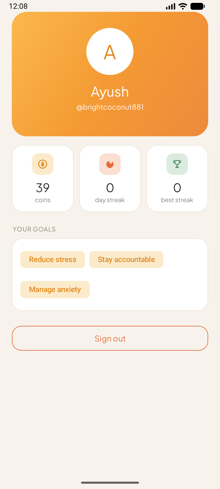
  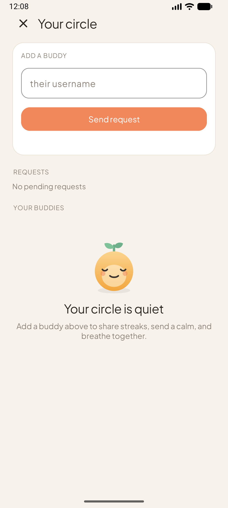
  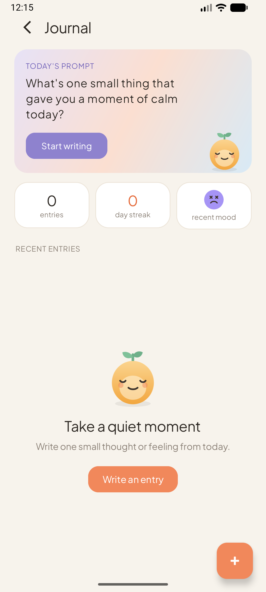
  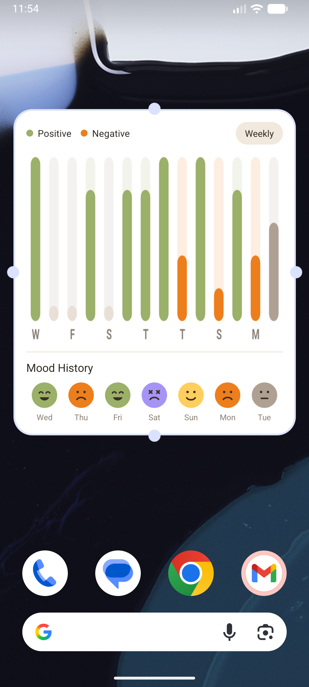
</p>

---

## Home-screen widgets

| Widget | Size | What it does |
|---|---|---|
| **Mellow — Mood** | 4×2 | Log today's mood in one tap, without opening the app |
| **Mellow — Mood Stats** | 4×4 | Positive/negative bars for the last fortnight + the last 7 days as faces |

Both read through the app's repository layer via a Hilt `EntryPoint`, so the one-mood-per-day rule and coin rewards behave exactly as they do in-app. The stats chart is drawn to a bitmap, since `RemoteViews` can't host custom views.

---

## Features

**Guided breathing check-ins** — four breaths, auto-advancing, with a fluid fill that rises and settles with each breath. Awards coins on completion.
`CheckInActivity` · `WaveView` · `GamificationEngine`

**Coin &amp; jar reward system** — coins accumulate in a jar with a randomised capacity. Fill it and a reward triggers, then the jar resets.
`GamificationEngine` · `UserProgress` · `RewardActivity`

**Soft streaks with a grace period** — missing a single day doesn't break your streak; a one-time grace absorbs the gap. Longest streak is always preserved.
`GamificationEngine.calculateStreakUpdate()` · `DateUtils`

**Mood tracking + on-device intelligence** — month and year trends, direction vs. the previous period, your strongest weekday, and a journaling correlation. All computed locally from mood logs merged with journal moods — no backend, works offline.
`MoodInsights` · `MoodOverview` · `MoodAnalytics`

**Journaling** — a daily prompt, mood per entry, backdating, and an insight strip (entries, journaling streak, dominant mood).
`JournalHistoryActivity` · `JournalRepository`

**Buddies** — send requests, connect, and nudge a buddy with a haptic buzz.
`BuddyActivity` · `BuddyRepository`

---

## Architecture

**MVVM**, Java, with a clean separation between UI, domain and data.

```
edu.northeastern.mellow/
├── data/
│   ├── model/         MoodEntry, JournalEntry, UserProgress, BuddyGroup, …
│   ├── repository/    interfaces + Firestore implementations
│   ├── mapper/        Firestore ⇄ model
│   └── util/          DateUtils, MellowResult, VibrationHelper
├── domain/
│   ├── engine/        GamificationEngine  — pure streak + coin logic
│   └── analytics/     MoodAnalytics, MoodInsights, MoodOverview
├── ui/                auth, onboarding, mood, journal, buddy, profile, progress
└── widget/            home-screen widgets
```

The `domain` layer is deliberately **pure** — no Android, no Firebase, all static methods — so the streak, coin and analytics logic is trivially testable.

**Stack:** Java · Gradle 8.13 · `compileSdk 36`, `minSdk 26` · Firebase Auth + Firestore (offline persistence on) · Hilt · Lifecycle ViewModel/LiveData · ViewPager2 · custom `Canvas` views for every chart

---

## Getting started

```bash
git clone https://github.com/ayushvarma7/Mellow.git
cd Mellow
```

1. Create a Firebase project and add an Android app with package name **`edu.northeastern.mellow`**
2. Enable **Authentication** (Google + Anonymous) and **Cloud Firestore**
3. Download `google-services.json` into `app/`
4. Add your SHA-1 to the Firebase project for Google Sign-In
5. Build:

```bash
./gradlew assembleDebug
```

> `google-services.json` is gitignored — the build will fail without it.

---

## Author

**Ayush Varma**

---

## License

Built for academic purposes as part of CS5520 at Northeastern University.
